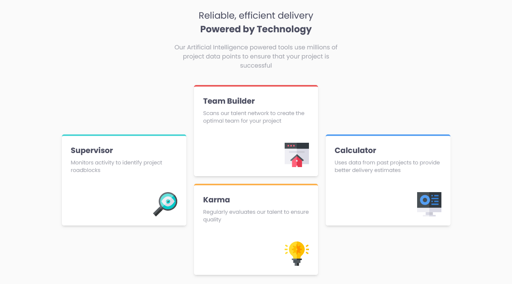

# Frontend Mentor - Four card feature section solution

This is a solution to the [Four card feature section challenge on Frontend Mentor](https://www.frontendmentor.io/challenges/four-card-feature-section-weK1eFYK). Frontend Mentor challenges help you improve your coding skills by building realistic projects.

## Table of contents

- [Overview](#overview)
  - [The challenge](#the-challenge)
  - [Screenshot](#screenshot)
  - [Links](#links)
  - [Built with](#built-with)
  - [What I learned](#what-i-learned)
- [Author](#author)

## Overview

### The challenge

Users should be able to:

- View the optimal layout for the site depending on their device's screen size

### Screenshot



### Links

- Solution URL: [github](https://github.com)

### Built with

- Semantic HTML5 markup
- Tailwind
- Flexbox
- Mobile-first workflow
- [React](https://reactjs.org/) - JS library
- [ Typescript](https://www.typescriptlang.org/) - extends JavaScript by adding types to the language.

### What I learned

Use this section to recap over some of your major learnings while working through this project. Writing these out and providing code samples of areas you want to highlight is a great way to reinforce your own knowledge.

To see how you can add code snippets, see below:

```js
type CardProps = {
  title: string,
  description: string,
  img: string,
};

function Card({ title, description, img }: CardProps) {
  return (
    <div
      className={` ${
        title === "Supervisor"
          ? "border-t-cyan"
          : title === "Team Builder"
          ? "border-t-red"
          : title === "Karma"
          ? "border-t-orange"
          : title === "Calculator"
          ? "border-t-blue"
          : ""
      } bg-white p-6 rounded-md shadow-md border-t-4  flex flex-col  lg:basis-1/3`}
    >
      <h3 className="text-xl font-bold text-darkBlue mb-2">{title}</h3>
      <p className="text-sm text-gray mb-12">{description}</p>
      <div className="self-end">
        
      </div>
    </div>
  );
}
```

## Author

- Frontend Mentor - [@Oloude](https://www.frontendmentor.io/profile/Oloude)
- Twitter - [@AbosedeOloude](https://www.twitter.com/AbosedeOloude)
